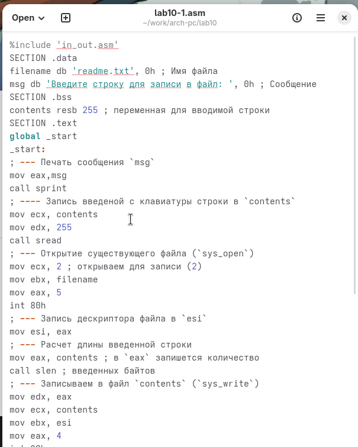
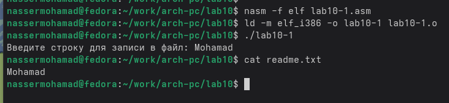
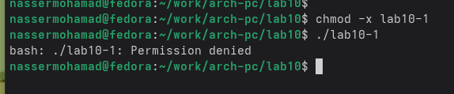
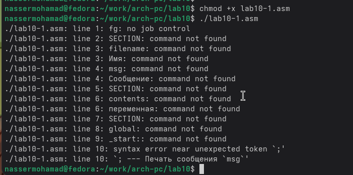
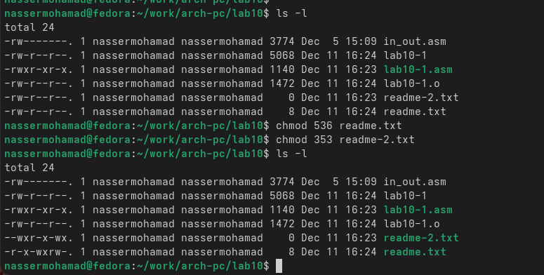
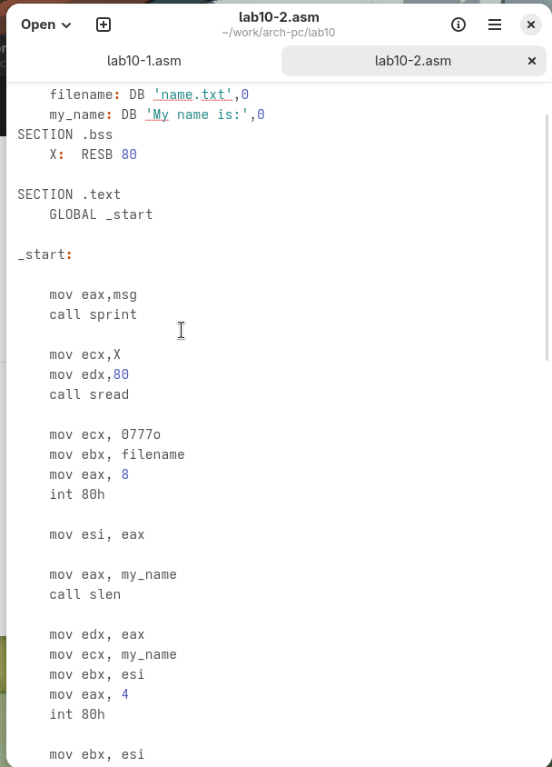
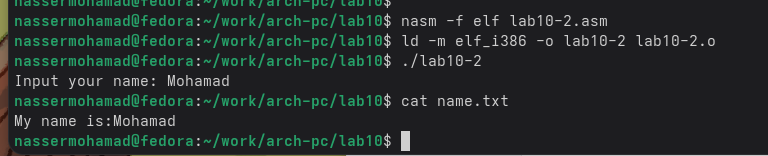

---
## Author
author:
  name: Нассер Мохамад
  email: 1132215102@pfur.ru
  affiliation:
    - name: Российский университет дружбы народов
      country: Российская Федерация
      postal-code: 117198
      city: Москва
      address: ул. Миклухо-Маклая, д. 6

## Title
title: "Отчёт по лабораторной работе 10"
subtitle: "дисциплина:	Архитектура компьютера"
license: "CC BY"
---

# Цель работы

Целью работы является приобретение навыков написания программ для работы с файлами.

# Выполнение лабораторной работы

Я создал каталог для лабораторной работы № 10 и перешел в него. 
В этом каталоге я создал три файла: lab10-1.asm, readme-1.txt и readme-2.txt.

В файле lab10-1.asm я написал программу из листинга 10.1, которая записывает 
сообщение в файл. Затем я создал исполняемый файл 
из этого кода и проверил его работу.(рис. [-@fig-001])

{ #fig-001 width=70%, height=70% }

Программа запрашивает строку и перезаписывает ее в файл readme.txt. 
Если файл не существует, строка не будет записана никуда.(рис. [-@fig-002])

{ #fig-002 width=70%, height=70% }

Чтобы запретить выполнение исполняемого файла lab10-1, я использовал команду chmod для изменения прав доступа. Я снял атрибут "x" во всех трех позициях. 
После этого я попытался выполнить файл.

Однако файл не запускается, потому что выполнение запрещено 
из-за отсутствия атрибута "x" во всех трех позициях. (рис. [-@fig-003])

{ #fig-003 width=70%, height=70% }

Я изменил права доступа к файлу lab10-1.asm, добавив права на выполнение с помощью команды chmod. 
Затем я попытался выполнить файл.(рис. [-@fig-004])

В результате, файл запустился, и терминал попытался выполнить его содержимое 
как команды командной строки. Однако, так как это файл с кодом на языке ассемблера, 
а не команды терминала, возникли ошибки. Тем не менее, если в такой файл добавить команды командной строки, то можно будет выполнить эти команды, запустив файл.

{ #fig-004 width=70%, height=70% }

Далее, я установил права доступа к файлам readme в соответствии с 
указанными вариантом в таблице 10.4. Чтобы проверить правильность выполнения, 
я использовал команду ls -l. (рис. [-@fig-005])

для варианта 3: ```r-x -wx rw-``` ```011 101 011```

{ #fig-005 width=70%, height=70% }

## Задание для самостоятельной работы

Написал программу работающую по следующему алгоритму (рис. [-@fig-006]) (рис. [-@fig-007]):

* Вывод приглашения “Как Вас зовут?”

* ввести с клавиатуры свои фамилию и имя

* создать файл с именем name.txt

* записать в файл сообщение “Меня зовут”

* дописать в файл строку введенную с клавиатуры

* закрыть файл

{ #fig-006 width=70%, height=70% }

{ #fig-007 width=70%, height=70% }

# Выводы

Освоили работy с файлами и правами доступа.
